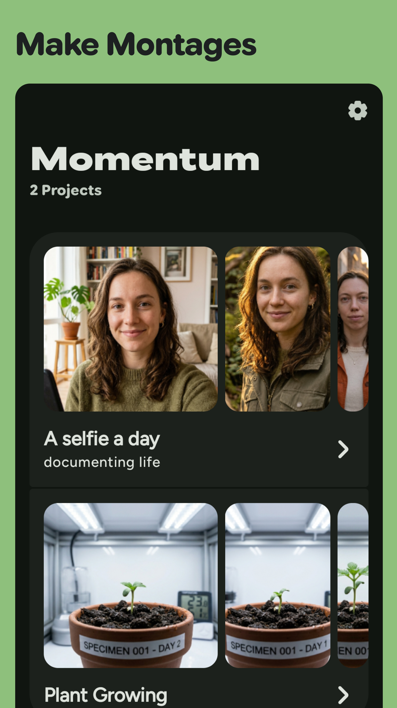
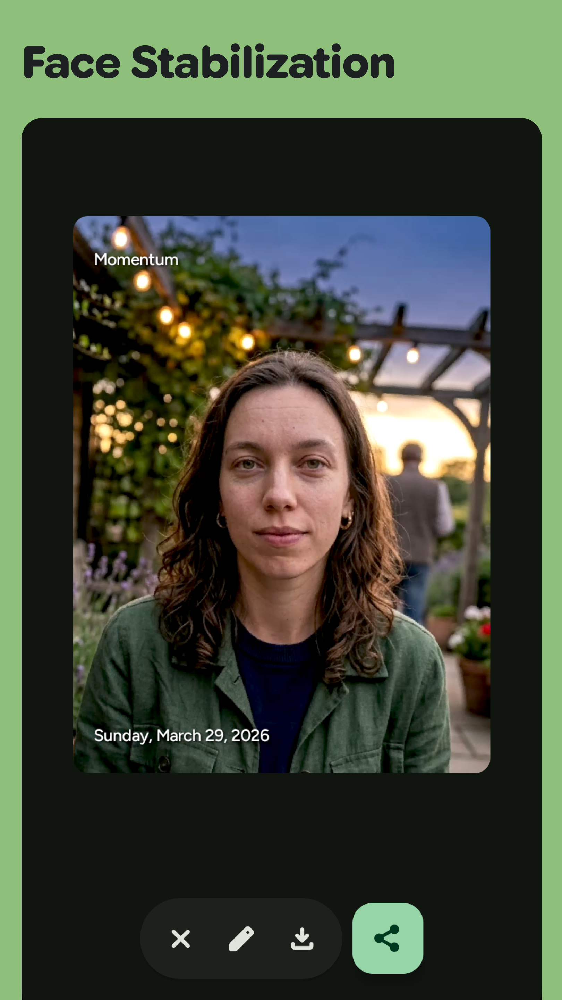
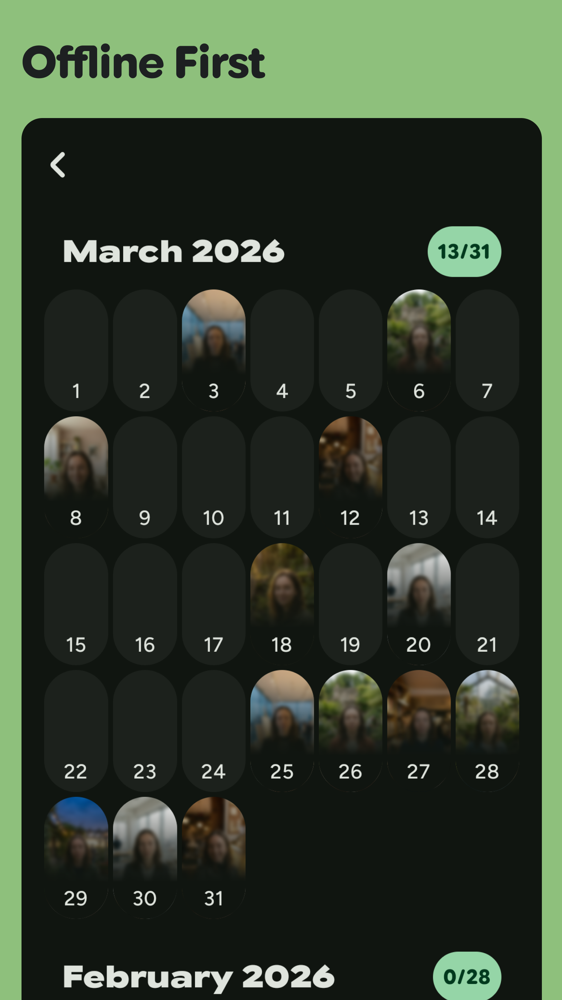
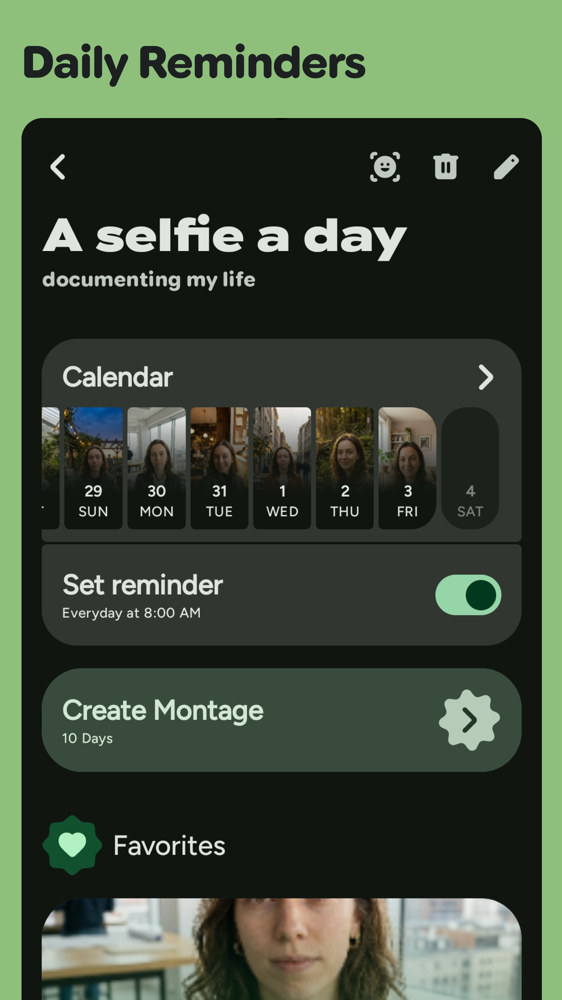

# Screenshots

::github{repo="shub39/Momentum"}

|  |  |
|:-------------:|:-------------:|
|  |  |

---

# Backstory

I'm sure we have all seen [this](https://www.youtube.com/watch?v=65nfbW-27ps&t=2s&pp=ygUPaHVnbyBjb3JuZWxsaWVy) video by
now. The guy consistently took selfies, stored, labeled them and in the end edited those thousands of pictures in a cool
montage. Ever since I saw this I have
always wanted to make a video like this but the sheer logistics and consistency required to take a picture every day,
store it and then edit it was
something I did not have. As I learned Android Development, I finally felt confident enough in my skills to turn this
idea into a real app. So Decided to build this
using [Revenuecat Shipaton 2025](https://devpost.com/software/momentum-m95t6u) as an excuse. It's a hackathon conducted
by Revenuecat to build and ship an app
to the playstore using their sdk to monetize it.

---

# Building the App

## Building the Video Maker

This was the hardest part to figure out. Turns out assembling a video is really hard with all the codecs, video formats
and standards out there. My first attempt was with
**FFmpegKit** which is like precompiled ffmpeg binaries already wrapped in JNI. Sadly it was
[discontinued](https://tanersener.medium.com/saying-goodbye-to-ffmpegkit-33ae939767e1) after I finished making a proof
of concept with it. I tried some forks
at that time, but they were all crashing with codec errors. It was torturous to get it to assemble a single video and
then the video won't play because of an
obscure cryptic codec error.

Since I did not know much about JNI and integrating native binaries into apps back then I decided to give up on it, But
one day I randomly asked
a Chatbot about ways to make videos from a list of bitmaps, and it came up with an alternate suggestion. Using
[Mediacodec](https://developer.android.com/reference/android/media/MediaCodec) I can assemble the video using the
device's own codecs, eliminating the need for ffmpeg
and JNI altogether.

The API was much more complicated than I expected and understanding it was becoming harder and harder. Thanks to a
friend on discord, found
[bitmap2video](https://github.com/israel-fl/bitmap2video) which is like a proof of concept app and library built with
the Mediacodec API. Initially I just copied
the video generation part from this library and made it work.

Later, I customized it to be more efficient and fine-tuned with the requirements of the app. Added fixed aspect ratios,
removed a bunch of dead code and made a module out of
the localized changes. At the end I had a very convenient and stable API with a bunch of parameters to customize the
videos. Learnt what these complex terms
actually mean and got a taste of how complicated dealing with videos is.

```kotlin
// all the different options available for making videos
data class MontageConfig(
    val mimeType: String = MediaFormat.MIMETYPE_VIDEO_AVC,
    val bitrate: Int = 10_000_000,
    val iFrameInterval: Int = 1,
    val framesPerImage: Int = 1,
    val framesPerSecond: Float = 1f,
    val videoQuality: VideoQuality = VideoQuality.SMALL,
    val backgroundColor: Color = Color.Black,
    val waterMark: Boolean = true,
    val showDate: Boolean = true,
    val showMessage: Boolean = true,
    val font: Fonts = Fonts.FIGTREE,
    val dateStyle: DateStyle = DateStyle.FULL,
    val stabilizeFaces: Boolean = false,
    val censorFaces: Boolean = false,
)
```

## Storing Images and Keeping track of them

The core database of the app is simple. It's just two tables, one of all the projects and their descriptions other is
all the days, which is an entity
wrapping the location of the image with additional info like date, face data and the project ID to use as a foreign key.
All using Room

I really wanted to use as little permissions as I could. Instead of accesing all the media files, I let the user select
the image they want to add for a day using the
[Photopicker API](https://developer.android.com/training/data-storage/shared/photo-picker?hl=en). I was requesting
[persistable URI](<https://developer.android.com/reference/android/content/ContentResolver#takePersistableUriPermission(android.net.Uri,%20int)>)
permission for each image that the user selected. Until I started facing some unexpected behaviours in production and
discovered it was a ticking time
bomb. Not only was this approach really naive but each app is only allowed to have a maximum of 512 persisted URIs at
any given moment.

Quickly scrapped that approach and opted for copying the selected images in the app's files directory. Thankfully it was
within 512 days, so I really
dodged a bomb there. The surprising thing is, This limit is not mentioned anywhere in the API docs. The only place I
found this was in an obscure
GitHub issue (which I can't find anymore) and the
[android source code](https://cs.android.com/android/platform/superproject/+/android-latest-release:frameworks/base/services/core/java/com/android/server/uri/UriGrantsManagerService.java;l=127?q=MAX_PERSISTED_URI_GRANTS&sq=)
😭

``` java
  // Maximum number of persisted Uri grants a package is allowed
  private static final int MAX_PERSISTED_URI_GRANTS = 512;
```

## Extracting faces from Images

This was simple, I knew [mlkit](https://developers.google.com/ml-kit) had an API for extracting faces from images for
android. So I implemented it pretty easily. But as
the number of images in a project grew, It became clear that the bounding boxes were not that accurate. The images won't
seamlessly transtition over each other and the
final result came out
jarring. Mlkit is also a closed source library, meaning I could not know how it works, publish my app on FOSS appstores,
add features or debug it properly. Also for some
reason mlkit processes can't run inside coroutines? it can only run in Google's `com.google.android.gms.tasks.Tasks`.
This really bothered me.

Then I came across mediapipe which is also a Google library that is more like a harness to run ml tasks across many
devices seamlessly.
It was FOSS and was much more accurate and
powerful than mlkit. The only downside is it is heavy and requires tasks to be included as assets. Besides face
detection it can also be used to analyze face landmarks, pose detection, emotions and much more which will be useful in
the future for other features.

One very peculiar thing I noticed with Mediapipe. It has a Google logging library built in, GoogleDataTransport. It is
an internal library that they use in their sdks for logging usage.
I tried to exclude this from my app by excluding it in buildscripts, which caused crashes. Then I tried stripping it out
using proguard, that caused unexpected bugs. Finally, I decided
to let it be but remove the network permission for the app entirely in the GitHub release. Without the network
permission the app can't log anything. It was crazy to see the lengths
google is going to collect telemetry. When a log attempt failed for some reason, It scheduled a job to try again later!
I'm probably naive, but I don't
get why telemetry is that important.

## Assembling the Video maker

To make things fast. Momentum processes and saves the face data for each image the moment they are selected. This
avoided flooding the cpu with ml tasks all at once. Also added a
button in each Day's page to view the bounding box around the face. With all the metadata collected for an image and
Montage creation preferences, wrote a function to create an edited
bitmap from the given image. Face adjustment, scale, watermark and text to be shown in the montage were configured in
this step.

Then the processed images are collected in flows to be passed to the video muxer, which takes the images as they are
generated and muxes them into a video all in sync

```kotlin
var processedCount = 0              // for tracking progress in UI
val bitmapFlow = flow {             // flow created
    sortedDays.forEach { day ->
        processDay(
            // function to process each day 
            day = day,
            config = config,
            textPaint = textPaint,
            censorPaint = censorPaint,
        )
            ?.let { bitmap -> emit(bitmap) }
    }
}

val flowForMuxer =
    bitmapFlow.onEach {
        processedCount++
        emit(MontageState.ProcessingImages(processedCount.toFloat() / total))
    }

when (val result = muxer.mux(flowForMuxer)) {  // muxer consuming the flow 
    is MuxingResult.MuxingError -> {
        emit(MontageState.Error(result.message, result.exception))
    }

    is MuxingResult.MuxingSuccess -> {
        emit(MontageState.Success(result.file, config))
    }
}
```

The first iterations of this pipeline were a total unoptimized mess. This is the way I am sticking to for now.

## The UI

It's all Jetpack Compose with MVI, obviously. MVI is the best design pattern, architecture, whatever you name it for
Jetpack Compose. All my states are in neat data classes and the UI
is just a function that takes the state. Also, a lambda to bubble up events. Tried to make it look more Material 3
Expressive.

``` kotlin 
@Immutable 
data class HomeState(val projects: List<ProjectListData> = emptyList()) // state

sealed interface HomeAction { // predefined actions the UI can perform
    data class OnChangeProject(val project: Project) : HomeAction
    data class OnAddProject(val title: String, val description: String) : HomeAction
}

@Composable
fun HomeGraph(   // UI composable that only takes the state and exposes a lambda for the ViewModel
    state: HomeState,
    onAction: (HomeAction) -> Unit,
    onNavigateToSettings: () -> Unit,
    onNavigateToProject: () -> Unit,
    isPlusUser: Boolean,
    onNavigateToPaywall: () -> Unit,
    modifier: Modifier = Modifier,
) {
    // ....
}
```

## Dependency Injection (Koin)

I tried out koin annotations with this project. With the introduction of the new Koin Gradle plugin, it's now much
easier
to inject classes. You just need to annotate them with
`@Single`, `@KoinViewModel` and koin will automatically detect these classes and validate if all the requested
injections are satisfied or not during compile time!

Behind the scenes, it's just an extra step over the regular service locator approach of koin. It just automates the
generation of a `Module` that
maps all the dependencies in the koin dsl

``` kotlin
@Single
class MyClass()

// generated code
module = module {
    single { MyClass() }
}
```

## Navigation 3

Also tried out the new navigation 3 after many friends suggested it. I am genuinely blown away by how simple it is to
implement. The backstack is just a list! and you add or remove
objects from it to navigate. You can also animate navigation easily using metadata and android's new predictive back
gestures are supported out of the box.

``` kotlin
// objects representing different nav destinations
@Serializable data object ProjectDetails : NavKey
@Serializable data object ProjectCalendarView : NavKey
@Serializable data object ProjectMontageView : NavKey
@Serializable data class DayInfoView(val selectedDate: Long) : NavKey

// just a list!
val backStack = rememberNavBackStack(ProjectDetails)

NavDisplay(
    modifier = modifier,
    backStack = backStack,
    entryProvider =
        entryProvider { // similar to nav 2
            entry<ProjectDetails> {
                ProjectDetails(...)
            }

            // metadata specifying transition animation between screens
            entry<ProjectCalendarView>(metadata = verticalTransitionMetadata()) { 
                ProjectCalendar(...)
            }

            entry<DayInfoView>(metadata = verticalTransitionMetadata()) {
                DayInfo(...)
            }

            entry<ProjectMontageView>(metadata = horizontalTransitionMetadata()) {
                ProjectMontageView(...)
            }
        },
)
```

---

# Conclusion

This project taught me a lot about how to build around android APIs and structure code into modules. Made a lot of
mistakes while building and learnt
from them. Momentum is currently available on
the [playstore](https://play.google.com/store/apps/details?id=shub39.momentum.play) and coming soon on
Fdroid and IzzyOnDroid

Turns out Hugo Cornellier (the guy who started it all) is a dev and already built a Flutter app for
this. [Agelapse](https://github.com/hugocornellier/agelapse)
is using mlkit for face stabilization. The app is great but its way too big (200+mbs!! 🤯) for an android app. I'm
curious if it can be optimised
somehow or are flutter apps expected to be that big?

I want to add many more features, A centralized page to manage all the generated montages, Camera Integration to take
pictures from within the app, A
background worker to generate montages if there are a lot of images, and more customisation options. Also want to
include a picture mode like the BeReal
app, where it takes a photo and a selfie simultaneously.

Thanks for reading!
