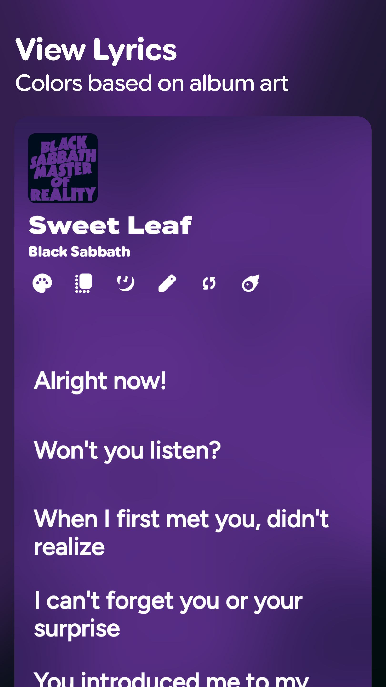
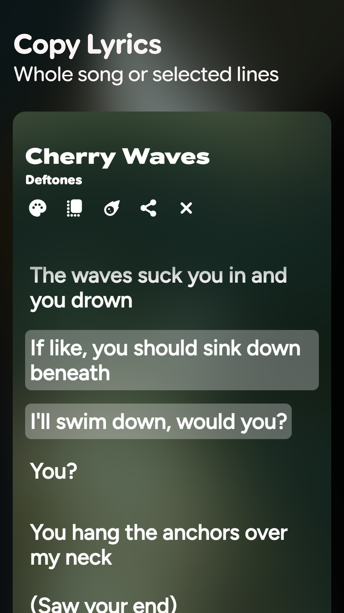
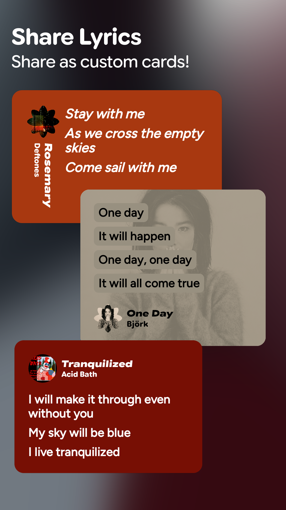
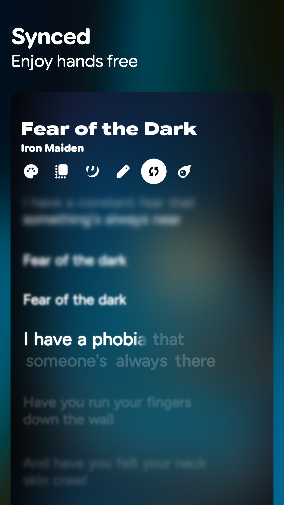

# Screenshots

::github{repo="shub39/Rush"}

|  |  |  |  |
|:-------------:|:-------------:|:-------------:|:-------------:|

# Backstory

As a music nerd, I am obsessed with finding the correct lyrics for songs. At first, I used Spotify but soon found out it
was missing lyrics for a lot of songs and many of the available lyrics were incorrect. Still kept using it as I really
liked the lyrics sharing feature, just tap on the line and share it as a Card on social media. All was going well but
one day Spotify decided to remove the lyrics sharing feature for songs out of the free tier, only to introduce it back
[again](https://9to5google.com/2024/07/31/spotify-makes-lyrics-free-again-but-with-a-monthly-limit/). This was the last
straw for me and I decided to make my own separate app for lyrics that would have all Spotify's features and would let
you view lyrics regardless of the music player you use.

---

# Building the app

## The Lyrics Source

### Genius

Initially, I was using only genius for the lyrics. The Genius API is good for getting accurate lyrics of songs as it is
a database of lyrics and metadata which is constantly under review by an active community. The only problem is the API
has no proper documentation mentioning rate limits. **Their free tier only provides song metadata.** Another similar app
[FastLyrics](https://github.com/teccheck/FastLyrics) was also using genius for lyrics and apparently the dev got an API
token with unrestricted access to all song data including lyrics. But I could not figure out how to get that kind of
token anywhere. According to the dev "there should be a way to create a better token,
[but it costs a little bit](https://github.com/teccheck/FastLyrics/issues/38)". So I asked them if I can use their Token
for now and they agreed. It was great to build out the first prototype of the app. One problem was Genius only provided
unsynced lyrics. But the accuracy was worth keeping it in the app still. Also, they have a good search API with the huge
database they have, that provides album art to make search results better. I kept Genius for the search and as a
fallback for accurate lyrics.

Eventually I started scraping from the search metadata that genius provided, As it had the link to the genius page. It
worked for a while but soon genius started to change its frontend code and the scrapers broke. It was rough for a few
weeks as when I changed the scraper logic and pushed and update, they changed the frontend code again and repeat.
finally I decided to scrape from a better source. [Dumb](https://github.com/rramiachraf/dumb) is a no nonsense frontend
for genius with self-hostable instances. I basically use the genius API for search and try to scrape from it. On
failiure, one of the active dumb instances is scraped. This may seem very unreliable. Maybe I should build my own
backend to handle these instead of dumping all responsibilities to the client.

### LRCLIB

[LRCLIB](https://lrclib.net/) is a free API for lyrics, and it also provides synced song lyrics for most of the popular
songs. It is mostly maintained and run by a single developer. So please support it if you can. It allowed me to add
synced lyrics to the app. It provides lyrics in the LRC format.

The only problem with the LRCLIB API is that the search is a bit unreliable at times, also the database contains a lot
of incorrect lyrics and lyrics with incorrect timestamps. Still it's faster than Genius and has synced lyrics.

### LyricsPlus

:::note[BACKSTORY]
I had created a discord server for my users, as a place to discuss and hangout. It is the primary source of
suggestions in my apps. One Rush user said *"shub implement apple music-like lyrics and my life is yours"* and I took
the challenge as an excuse to implement syllable synced lyrics.
:::

[LyricsPlus](https://github.com/ibratabian17/lyricsplus) is a FOSS backend implementation that scrapes lyrics from a
bunch of sources and can be self-hosted. Best part is, It provides syllable level synced lyrics for songs. It's the most
recent addition to the app. It allowed me to add beautiful syllable level sync for lyrics. To say it was an improvement
would be an understatement.

## Syncing with Your Music

I used the [Mediacontroller](https://developer.android.com/reference/android/media/session/MediaController) API to get
current song playback info from the notification manager. It was quite finicky at first but after many iterations its
stable and reliable now. The logic is wrapped in a Medialistener object and suspend functions are exposed to
pause/resume playback or skip to previous/next track. Also, the ability to set playabck to a particluar timestamp by
just tapping at a line in the UI. This was added by [bartoostveen](https://github.com/bartoostveen), This contribution
really opened up my mind as I was just a begginer at that time. A very miniscule change that significantly increased the
possibilities. I suddenly became aware there is so much more possible with the Android APIs.

:::note[SIDETRACK]
I really like the concept of objects in kotlin, not to be confused by the runtime objects created from classes. Object
is a dedicated keyword in kotlin to encapsulate logic and methods. Objects are all only created once over the lifetime
of the app, So I don't need to worry about creating duplicate objects or any conflicts.
:::

The Mediacontroller API requires notification access permission to be granted for the app. Which is a super sensitive
permission to be granted to a 3rd party app. For this reason, many OEMs put a 10-second disclaimer whenever the user
is prompted to allow this permission. This can make a lot of users to stop using Rush due to mistrust. Thankfully, Rush
is FOSS and I will keep it that way. Users can audit easily what the app does with the permission and with the help of
LLMs it's much easier now.

I think the Mediacontroller API can be decoupled from NotificationManager and kept as a separate permission.

## Rush Mode

The whole point of FastLyrics is to get the lyrics for your current playing song quickly. And it's pretty good at it. I
borrowed this concept for Rush Mode, except the fast part. Being fast is not the priority, It's being **accurate** and
providing the **best experience** possible. Imagine you are listening to an album, after each track you don't want
to manually search for it and continue, In Rush Mode, the app listens for changes in the playing song. When changed,
automatically fetches lyrics for it.

The Mediacontroller API provides callbacks when song metadata changes. Using that I set up a flow to trigger a fetch.
It's pretty simple but very convenient.

## The Database

Rush uses a simple SQLite database using ROOM, All the tracks are uniquely identified by their ID, which is obtained
from their corresponding Genius ID. It's just a simple table. I had to migrate it twice while adding columns for synced
and syllable-synced lyrics. With the help of schemas and Migration Tests, Its become pretty easy to manage it. I have
implemented a way to export or import the database of saved lyrics through a JSON file. Just serializing and
deserializing the contents of the database.

## Building the UI

It's all Jetpack Compose following MVI (Model-View-Intent) principles. All screens consist of a simple composable that
only take a state to render UI, making previews and tests easier. The screens are pretty simple except the Lyrics
Screen. Users can customize their lyrics experience in great detail.

```kotlin
data class LyricsPageState(
    // ...
    // All the appearance settings
    val blurSyncedLyrics: Boolean = true,
    val textPrefs: TextPrefs = TextPrefs(),
    val cardColors: CardColors = CardColors.MUTED,
    val lyricsBackground: LyricsBackground = LyricsBackground.SOLID_COLOR,
    val maxLines: Int = 6,
    val mCardBackground: Int = Color.DarkGray.toArgb(),
    val mCardContent: Int = Color.White.toArgb(),
    val fullscreen: Boolean = false,
)

// All the text settings
data class TextPrefs(
    val fontSize: Float = 28f,
    val lineHeight: Float = 32f,
    val letterSpacing: Float = 0f,
    val lyricsAlignment: LyricsAlignment = LyricsAlignment.CENTER,
)
```

- `blurSyncedLyrics` : Toggle to blur the non-focused lines while displaying synced lyrics. Blurring gives it a more
  dream-like experience.
- `textPrefs` : Parameters for controlling text. Users can customize the fontSize, lineHeight, letterSpacing,
  lyricsAlignment, etc. To make it look exactly as they want.
- `cardColors` : Users can select between **MUTED**, **VIBRANT** and **CUSTOM**. MUTED and VIBRANT colors are
  extracted form the Album Art of the track using [Kmpalette](https://github.com/jordond/kmpalette). While the custom
  option lets the user choose their own background and content colors. Using
  [colorpicker-compose](https://github.com/skydoves/colorpicker-compose). The custom colors are stored in
  `mCardBackground` and `mCardContent`
- `lyricsBackground` : This is the background style for the lyrics. There are many options to choose from.
  The animated backgrounds were made possible because of [Bodya](https://github.com/bpavuk). They made an entire module
  wrapping up the Android Visualizer API into an easy to use compose state.

```kotlin
enum class LyricsBackground {
    HYPNOTIC, // Uses shaders to make an animated flow effect
    ALBUM_ART, // Uses a blurred and scaled version of the album art, like Apple Music
    SOLID_COLOR, // Solid Color. duh

    // Animated with music
    WAVE, // A wave like pattern
    GRADIENT, // A subtle soft gradient
    CURVE, // A set of horizontal lines that curve and thicken
}
```

- `maxLines` : The maximum no. of lines allowed to be selected for sharing.
- `fullscreen` : Toggle for hiding navigation and status bars in lyrics page.

All together, This allows for a highly customizable Lyrics Screen for each User. I have some doubts about allowing
this level of customization. As now, There isn't really a standard design that Rush will be known for. Like Spotify or
Apple Music have their own designs that anybody can look and recognize. But ultimately, I feel like this was the best
approach.

## The Share Cards

I wanted this to be the highlight feature of Rush. But it turned out to be the least used feature. At least I use It
enough to justify maintaining it. I have put a lot of effort into building this.

Initially, I just used the `rememberGraphicsLayer()` function to create a scoped graphics layer and drew the composable
into it to convert it into an image. It was working fine on my devices and emulators, So I pushed it to production.
Then I tested the app on my friends phone, who uses very high display size and text. The image was all over the place,
It didn't look like I had intended it to. The text was large and out of proportion, the corners looked out of place. It
was just an ugly mess.

Jetpack Compose is not built with pixel perfect UI in mind. It was built from the ground to be as adaptive as possible,
meaning it would adapt to the device's pixel density and dimensions to give the best possible render of the UI. It
cleared a very fundamental misconception I had about it.

The units of measurement in compose like `Dp`, `Sp`, etc. Are calculated based on the display of the device and user
preferences and will produce different results in different devices.

Thankfully there are functions like `toDp()` and `toSp()` to convert px measurements. This allowed for the card
dimensions to be exactly the same in all screens.

```kotlin
@Composable
fun pxToSp(px: Int): TextUnit {
    val density = LocalDensity.current
    return with(density) { px.toSp() }
}

@Composable
fun pxToDp(px: Int): Dp {
    val density = LocalDensity.current
    return with(density) { px.toDp() }
}

@Composable
fun TextStyle.fromPx(
    fontSize: Int,
    letterSpacing: Int,
    lineHeight: Int,
    fontWeight: FontWeight = FontWeight.Normal,
): TextStyle {
    return copy(
        fontSize = pxToSp(fontSize),
        letterSpacing = pxToSp(letterSpacing),
        lineHeight = pxToSp(lineHeight),
        fontWeight = fontWeight,
    )
}
```

There are a large variety of cards available with customizable feature on each one. I really want to explain each one
here, but It would be boring. It'll be better if you download Rush and explore the options yourself!

## Distribution

Rush is available on the Play Store, F-Droid and IzzyOnDroid. The links can be found in the GitHub repository. I have
set up CI actions to automatically build and release the apk on GitHub on every commit starting with **[release]**
from there the F-droid and IzzyOnDroid servers detect the release and add it to their listings. F-Droid builds and
signs the apk in their own servers, confirming reproducibility. Play store releases are manual as they are made with a
separate applicationId and need to be aabs. There are services like [tramline](https://tramline.dev/) for automated
playstore releases, but I am too paranoid to try them.

---

# Conclusion

In some sense, I feel proud of the work I have put into this. This project feels my own child now. From making
utterly dumb mistakes to fixing misconceptions and wrong understanding about the Android platform, This project has
seen it all. I can safely say that Rush has reached its final stages. There is really nothing significant left to add
to it now. It's exactly as how I envisioned it when I started making this. And I still keep under-estimating myself.
This project has been a journey and a way of making many great friends.

I will keep Rush updated to the latest design standards and add some
[leftover features](https://github.com/shub39/Rush/discussions/113). Possibly maybe write my own backend for lyrics
and host it. Removing dependency on Genius and making it completely FOSS.

Probably add a feature to generate lyrics for your local tracks using a local model. The advancements made by Gemma 4
look promising in that aspect.

Thanks for Reading!
