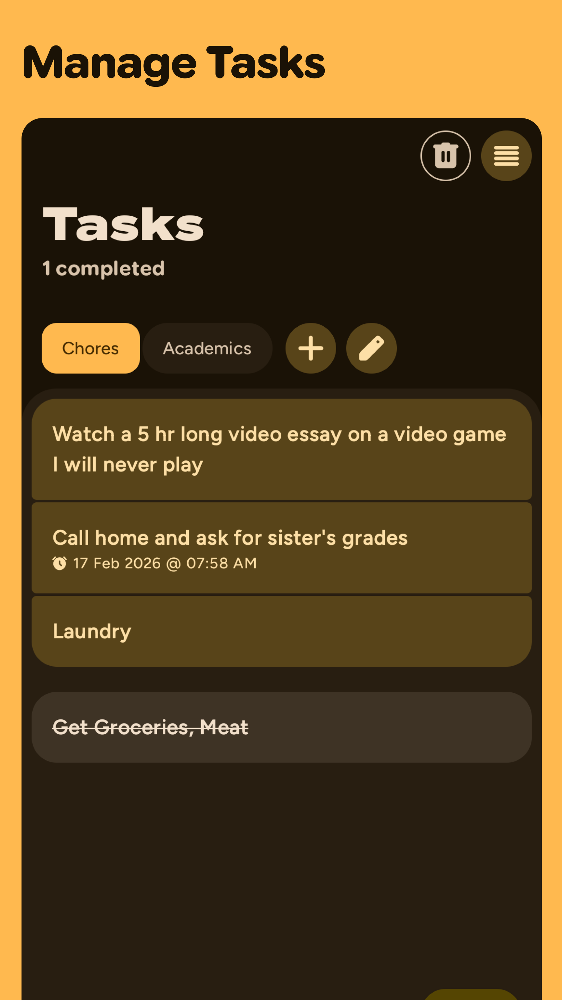

# Screenshots

::github{repo="shub39/Grit"}

|  |  |  |  |
|:-------------:|:-------------:|:-------------:|:-------------:|

# Reflection

I made Grit two years ago as an alternative to [Loop](https://loophabits.org/) with only the features that I needed.
never thought it will surpass my previous app, Rush in GitHub stars. It's a very trivial stat but I'm proud of it.
Made a video talking about it. 

<iframe
width="100%"
height="468"
src="https://www.youtube.com/embed/sHxqxL8mrKo"
frameborder="0"
allow="accelerometer; autoplay; clipboard-write; encrypted-media; gyroscope; picture-in-picture"
allowfullscreen>
</iframe>

---
