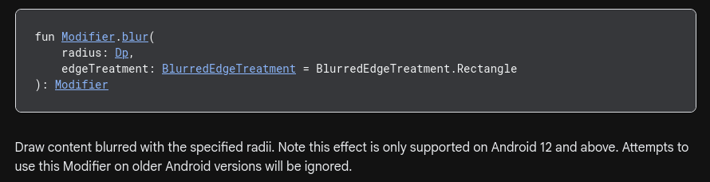

Having more than a billion devices worldwide, Android is one of the most rewarding platforms to
build for. But it's also the most challenging to get into. Compared to web there are so many moving parts
and blockers to overcome. It's even harder when you just make apps for yourself or for recreation, almost like the
the platform does not want you to do that. 

I became an Android Dev because I was inspired from apps like [Saikou](https://github.com/brahmkshatriya/saikou) and 
[Kotatsu](https://github.com/KotatsuApp/Kotatsu). I was so moved by how useful these apps were that I decided to learn
android to build my own apps. I started by building better versions of existing apps. Built 
[Rush](https://github.com/shub39/Rush) as an alternative to [FastLyrics](https://github.com/teccheck/FastLyrics/) and
[Grit](https://github.com/shub39/grit) as an alternative to [Loop](https://github.com/iSoron/uhabits). I faced so many
problems as a beginner that I wished someone had told me about. I'm writing this to hopefully help others with the
experince I have dealing with this platform.

## You need a Good Machine

Android Studio is the official and unfortunately the only IDE you will use for Android Dev. It's a powerful IDE but
it is very heavy. If you have less than **8GBs** RAM on your machine, you will struggle with it. Forget running the 
app on an emulator. If you are serious about mobile dev, you need to get a good machine. The best option being a high
end MacBook, if you want to dabble into iOS in the future.

I built my own PC with the best possible CPU and RAM configuration I could afford. Still, minified builds atleast take
3 minutes to complete. And I frequently run out of memory while running an emulator or debugging. On linux, I 
frequently need to kill leaking java processes and invalidate all IDE caches atleast once a month. 

## It's Moving Fast

There's a new version of Android Studio almost every week, and a new Android SDK every half an year. The Android team
ships fast and often break things. After each update, there's a high chance that some feature that you used will not
work anymore. At this point, it is an expectation. New features often break existing ones and deprecations are common.
Even the stable builds leak memory and no version of android studio is fast. If you are coming from another IDE like
Zed, expect performance to be ridiculously slow while having to update twice as much.

## You might unintentionally miss things

The Android SDK changes are a whole another issue. You can't expect an API to be available on all Android versions. For
example, in Jetpack Compose, there is a Blur API that can be used to blur UI elements. It can be used as a modifier in
Composable functions. A beginner might use it and think it will work no matter what. But they have not read the docs
for it. In production they might think that it works well but might notice some users reporting that blur does not
work. They might waste hours wondering why, scanning their code for the source of the issue, only to realize that
Android silently 
[ignores its usage on A11 and below](https://developer.android.com/reference/kotlin/androidx/compose/ui/draw/blur.modifier?hl=en#(androidx.compose.ui.Modifier).blur(androidx.compose.ui.unit.Dp,androidx.compose.ui.draw.BlurredEdgeTreatment)). 

## How do you distribute your app?

So you spent months, building an App and now you want to distribute it to your friends and family. You try to share
them the debug build that you were running on your phone through Android Studio. But wait, it's more than 40MBs!! You
can't just share it directly on most social media apps, Even if you manage to share it, it won't work on their device
as it was "Signed with debug key". A beginner is not expected to understand this concept and most just give up.

The official android documentation suggests [these](https://developer.android.com/distribute/marketing-tools/alternative-distribution)
ways to share apps. Which are no better than just sharing the APK file directly. 

Android is also taking away the ability to install apps from unknown sources in september of this year. This will make
it harder for beginners to share their work, besides taking away one of the only things people preferred Android over
iOS. One of the best experiences a beginner can have is showing their work to their friends. It's so much easier for
web developers as they can just host their apps on free hosting services but Android Devs are stuck with an APK file
that needs to be installed on the target device. This extra step creates a lot of friction among beginners.

If someone wants to go the official route to share their app, they need to pay $25 dollars for a Google Play Developer
account and upload their personal documents and provide their own address to Google Play. On top of that they need to 
comply with a huge list of policies and guidelines that becomes overwhelming for beginners. 

Documentation on how to fix build errors is almost non-existent. Every app ends up with their own unique set of build
errors. Proguard and R8 while significantly improving the app's security and performance can be a tough learning curve
for beginners. It sometimes takes days to fix a simple build error. There are no guarantees that the next library 
update won't silently break your build actions. At the end of a long productive session, testing the app in debug mode
when you finally relax and trigger a release build only to see that the app won't compile becuase of a cryptic Proguard
error is definitely one of the worst experiences I had.

## Architecture Principles are required 

Jetpack Compose won't punish you when you put a network call inside your composable function. It's too easy to mix 
things up which are supposed to be strictly separated. Jetpack Compose is one of the best UI frameworks out there.
But it's too flexible. You can do long tasks inisde your UI code and unknowingly make the UI unresponsive.

Kotlin is the best language I have ever used. It's so expressive and easy to understand than other languages. You can
use it as a functional language or an object-oriented language or a mix of both. This leads us to the first trap that
beginners fall into. **Just because you can use Kotlin however you want, does not mean you should.** 

You can write everything as functions and call them directly from your UI code but as your app grows it'll be harder
and harder to maintain, find bugs or add new features. I learnt this the hard way. I wrote a lot of code in random 
files scattered across the project without any structure. Later as I started adding new features I found myself
struggling to understand my own code. Often, I would add the feature and it will break something else in the app.

Learning about architecture principles and best practices is required to building an app you intend to maintain. 
otherwise you'll just end up frustrated and abandoning it. I learnt about architecture by copying other open source
apps on github. Browsed through a ton of codebases, articles and youtube tutorials to finally have a clear 
understanding on how to write maintainable code. 

## The community is hard to find

In a world where all your peers are becoming web devs, No one is interested in learning Mobile. The Mobile Dev 
community is very exclusive and mostly consists of senior devs who are too busy to help beginners and share their
knowledge. Most devs that do turn it into a paid course or book. It's not a wrong thing to do but compared to a sea of
free resources available to start learning Web, It's very discouraging for students to get started with Mobile.

I do my best to help people interested in learning Android Dev. I redirect them to good resources and help them with
issues to the best of my abilities. But I'm not a teacher or a mentor. I'm just a developer who loves to share 
knowledge. Most Mobile Dev courses in formal educational institutions are ridiculously outdated. Since android is so 
fast and constantly evolving, it's important to stay up-to-date with the latest tools and libraries.
